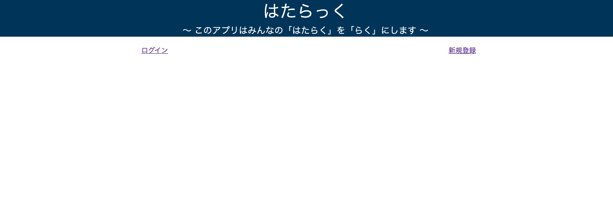
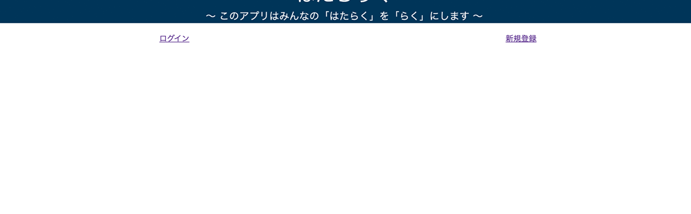
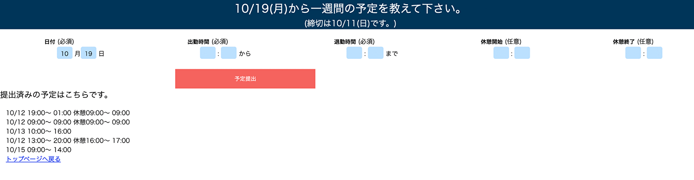
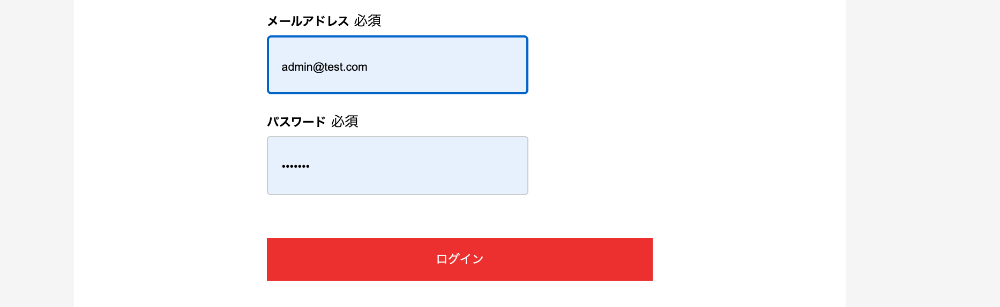

# README

# アプリ名
## HATA_LUCK(はたらっく)
 店舗型のビジネスで、予定の管理を効率化するアプリです。  　
 スタッフは予定の提出と確認。店長は来週と再来週の全員の予定の確認が簡単にできます。 
 

## 制作背景
### [課題]
 飲食店などの店舗型のビジネスにおいて、スタッフの予定管理は非常に重要です。   スタッフの収入に直結するためで、予定に間違いがなく、なるべく希望に沿った額を稼ぐことができれば、モチベーションの向上につながります。 しかし、スタッフの予定提出方法は手書きメモ、メール、ラインなどと統一されてないことが多く、予定の管理は単純作業であるにも関わらず、大変手間がかかり、店長にとっては頭の痛い課題です。 
 これらの課題を解決するためのアプリです。
  以下、スタッフ => ユーザー、店長 => 管理者に置き換えます。 

## 本番環境 
 HEROKUにデプロイしています。  
 こちらからアクセスできます。  
 [hata_luck](https://hata-luck-28277.herokuapp.com/)

### <テストユーザーアカウント>
 メールアドレス： yama@gmail.com  
 パスワード： yamada01

### <管理者ユーザーアカウント>
 メールアドレス： admin@test.com  
 パスワード： admin01
 
### [機能紹介]
こだわり機能には☆マークがついています。 
 ユーザーは、①アプリを開き、②ログインし、③日付→勤務開始時間→勤務終了時間を設定し、④登録ボタンを押すだけで予定提出完了！
 #### 新規登録とログイン機能
 
  
 ユーザー管理にはdeviseを使用しました。 
 エラー発生時には日本語でエラーメッセージが表示されるようにrails-i18nを導入しました。 
 
 #### ☆予定登録
 
 ＜とにかく使いやすく＞ 
 登録してほしい期間と締め切りを、週毎に自動で更新していきます。 
 日付は登録できる予定の最初の日がデフォルトで表示されています。(当然他の日を選ぶことは可能です。) 
 出勤時間や退勤時間は15分単位で、00分の時は選ばなくても登録できます。 
 休憩時間は任意ですので、空でも登録できます。 
 自分が登録した予定一覧を確認できるようにしてあり、同一出勤日を登録するなどの間違いを未然に防ぎます。 
 予定一覧には、編集ボタンと削除ボタンが付いていて、いつでも変更できます。 
 (過去の予定は表示されず、締め切りを過ぎた予定の編集と削除ボタンはありません。) 
 
 ＜バリデーションと条件分岐で間違いがないように＞ 
 gem 'jc-validates_timeliness'を導入し、時間のバリデーションをしました。 
 同一ユーザーが同一出勤日を登録することはできません。 
 締め切り日を過ぎたら予定の登録ができなくなります。 
 出勤時間と退勤時間は空では登録できません。 
 退勤時間は出勤時間より前の時間を登録することはできません。 
 (休憩時間のバリデーションがまだです) 
 
 #### 予定の編集と削除
 
 変更したい予定の変更するボタンを押すと、予定の変更が簡単にできます。 
 削除したい予定は、取り消すボタンを押すだけで、削除できます。 
 締め切り日を過ぎたら予定の編集と削除ができなくなります。 

 管理者は、①アプリを開き、②(管理者権限で)ログインし、③予定確認ボタンを押すだけで、来週月曜日〜二週間分の全員の予定が確認できます。
 #### 管理者の予定閲覧
 
 管理者機能はgemを使わず、userテーブルにadminユーザーをboolean型で追加しました。 
 管理者ができることは、全員の予定の閲覧のみです。 
 (退会ユーザーの削除、予定の編集などは検討中です。) 

## 使用技術
・HTML
・CSS
・Ruby 2.6.5
・Ruby on Rails
・MySQL
・VSCode
・GitHub

# 課題や今後実装したい機能
 
### レスポンシブ対応
　特にスタッフはスマホで使用するため、必要だと思います。

### LINEとの連携
　スタッフの登録のし易さ、使いやすさのためです。

### 予定の確認をエクセル形式のファイルで確認、編集
 予定確認画面でエクセル形式でパッと見で確認できるようにし、 
 さらにそのまま編集して、閲覧や印刷可能にしたいと思います(管理者) 
 また、トップページに今日の予定を閲覧できるようにしたいです。(全員) 
 
### ユーザーが使いたくなるUI/UX
 シンプルで、使いやすいデザインにしたいと思います。

### AWSにデプロイ
　一度挑戦してみたのですができなかったので、もう一度挑戦してみます。

# テーブル設計

## users テーブル
| Column             | Type    | Option      |
| ------------------ | ------- | ----------- |
| last_name          | string  | null: false |
| first_name         | string  | null: false |
| last_name_kana     | string  | null: false |
| first_name_kana    | string  | null: false |
| email              | string  | null: false |
| password           | string  | null: false |
| birthday           | date    | null: false |
| admin              | boolean | null: false |

### Association

-has_many :shifts

## shifts テーブル
| Column        | Type       | Option                         |
| ------------- | ---------- | ------------------------------ |
| work_day      | date       | null: false                    |
| start_time    | time       | null: false                    |
| end_time      | time       | null: false                    |
| break_start   | time       |                                |
| break_end     | time       |                                |
| user          | references | null: false, foreign_key: true |

### Association

-belongs_to :user

